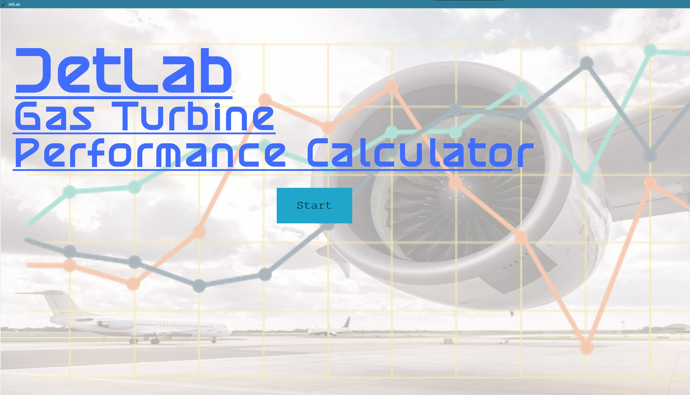
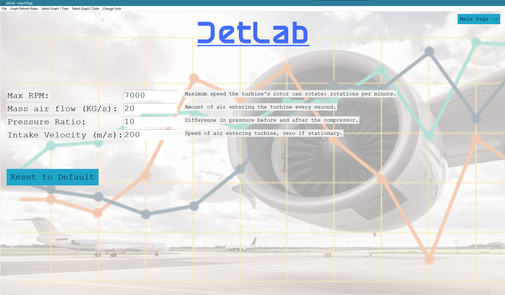
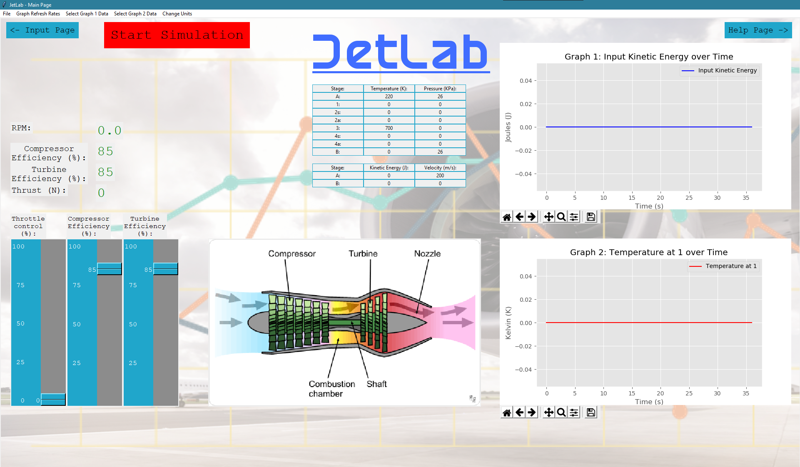
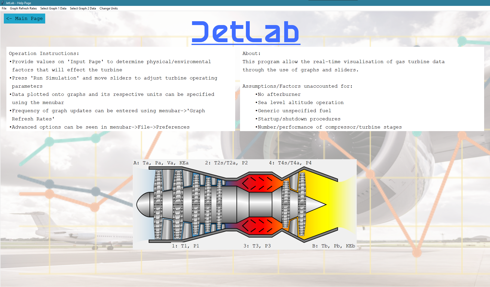

# JetLab

Uni second year group project

Gas turbine engine "simulator"

Writes a log of what the engine is doing to "data_log.txt"

### Start page

### Inputs page

### Main page

### Help page

